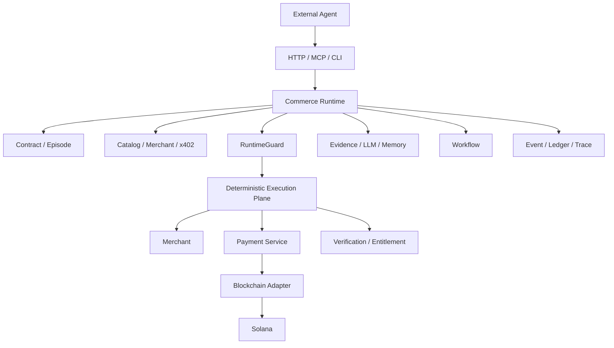
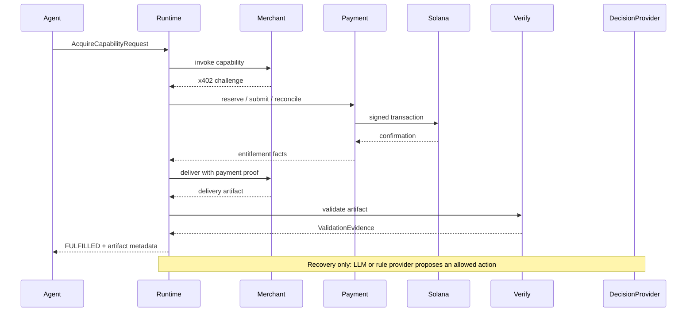

# StablePay

StablePay is an Agent Commerce Runtime for controlled paid-capability execution. An external agent submits an `AcquireCapabilityRequest`; the Runtime owns discovery, merchant invocation, x402 negotiation, payment, entitlement, delivery validation, recovery, parent approval, and the final artifact.

StablePay is a research and portfolio engineering system. The repository contains a deterministic payment plane and a Runtime above it; it is not a claim that the system currently serves production traffic.

## What the Runtime guarantees

The control boundary is intentionally one-way:

```text
State
  -> Action / Observation
  -> Decision Proposal
  -> RuntimeGuard
  -> Deterministic Execution Plane
  -> Event / Ledger / Trace
```

LLM output is a proposal. Runtime validation and the deterministic execution plane decide whether an action is allowed. Memory is advisory and transaction-grounded; it is not payment, budget, entitlement, candidate, or validator authority.

Business amounts are integer minor units. For a two-decimal business currency, `amount_minor=200` means `$2.00`; blockchain token raw units and merchant x402 atomic units are separate representations.

## Architecture



The lower StablePay plane remains visible: API Gateway, DID Service, Payment Service, Blockchain Adapter, Verification Service, Query Service, RocketMQ, MySQL, and Solana. The Runtime composes controlled adapters around that plane; it does not replace or duplicate it.

## End-to-end flow



## Workflow example

Workflow is a static declarative DAG that orchestrates child Episodes. Episodes own commerce execution. Version 1 is sequential, has exactly one output sink, and moves validated artifact metadata through `workflow-artifact://run/step` references; artifact bodies are resolved only at the explicit artifact endpoint or inside the bounded data plane.

```text
WorkflowDefinition -> WorkflowRun -> WorkflowStep -> CommerceEpisode
Step A -> validated artifact reference/hash/type -> Step B
```

## Repository map

```text
commerce-runtime/       # Runtime, HTTP/MCP surface, CLI, workflow and eval
stablepayai-idl/        # canonical Thrift, OpenAPI and event contracts
stablepay-common/       # shared non-communication foundations
api-gateway/            # public payment-plane gateway
did-service/            # DID registry and signature verification
payment-service/        # payment lifecycle and event producer
query-service/          # read-only payment-plane queries
verification-service/   # entitlement and purchase verification
blockchain-adapter/    # Solana transaction boundary and hot-wallet adapter
merchant/               # x402 Merchant reference service
docs/                   # architecture, evidence, runbook and freeze records
scripts/                # reproducible local gates and integration entry points
```

## Runtime surface

Start the Runtime from `commerce-runtime/cmd/server`. Authenticated endpoints are:

```text
POST /v1/episodes
GET  /v1/episodes/:id
GET  /v1/episodes/:id/events
GET  /v1/episodes/:id/observability
POST /v1/episodes/:id/parent-decisions
POST /v1/workflows
POST /v1/workflow-runs
GET  /v1/workflow-runs/:id
POST /mcp                  # initialize, tools/list, tools/call
GET  /healthz              # unauthenticated liveness
GET  /readyz               # unauthenticated MySQL/composition readiness
```

MCP is ingress only. `stablepay.acquire`, `stablepay.status`, `stablepay.approve`, `stablepay.run_workflow`, `stablepay.workflow_status`, and `stablepay.workflow_approve` use the same Runtime boundary as HTTP; MCP does not invoke payment, merchant, memory, or LLM internals.

The external CLI is an HTTP client:

```powershell
cd commerce-runtime
go run ./cmd/stablepay-runtime acquire --file request.json
go run ./cmd/stablepay-runtime status --episode-id <episode-id>
go run ./cmd/stablepay-runtime approve --episode-id <episode-id> --approval-id <approval-id> --decision APPROVE --actor-ref parent:1
```

`Idempotency-Key` must match `request_id` for episode/workflow creation and `approval_id` for parent decisions. Non-probe calls require the Runtime bearer token or `X-API-Key`.

## Reliability and safety model

- The authoritative business state is `CommerceEpisode`; operational runner state is a separate `EpisodeExecutionStatus` projection.
- `RunEpisode` and `ResumeEpisode` load persisted state on every run. The supervisor scans persisted runnable episodes after restart and uses bounded retry scheduling.
- Payment idempotency is owned by the Payment Intent/Ledger boundary. Runtime retry does not mean a new economic identity.
- Parent approval is a durable `ParentApprovalRequest` plus `ParentDecisionFact`, including quote-threshold approval.
- Agent DID is distinct from the payment-plane hot wallet. The Runtime receives opaque credential references; payment signing remains in the adapter/payment boundary.
- Errors and observability exports redact API keys, DSNs, private keys, signed transactions, raw prompts, and raw model responses.

## Evaluation and evidence

The committed replay example under `commerce-runtime/testdata/s11/example` is explicitly **EXAMPLE / REPLAY - NOT A LIVE BENCHMARK**. It must not be used to claim DeepSeek, Payment Service, Devnet, or production latency. Live-local evidence uses deterministic local adapters and is labelled `live_local`; a real provider claim requires a persisted `ModelDecisionTrace` and the matching Runtime variant.

The final evidence set is maintained in:

- [docs/ARCHITECTURE.md](docs/ARCHITECTURE.md)
- [docs/EVIDENCE_MATRIX.md](docs/EVIDENCE_MATRIX.md)
- [docs/FINAL_ARCHITECTURE_REVIEW.md](docs/FINAL_ARCHITECTURE_REVIEW.md)
- [docs/RESUME_EVIDENCE.md](docs/RESUME_EVIDENCE.md)
- [docs/LIMITATIONS.md](docs/LIMITATIONS.md)
- [docs/FREEZE_MANIFEST.md](docs/FREEZE_MANIFEST.md)

## Quick start

1. Start the checked-in infrastructure compose file:

   ```powershell
   docker compose -f .\stablepayai-idl\docker-compose.infra.yml up -d
   ```

2. Use the existing service configuration and an ignored local `.env` for credentials. Do not copy credentials, DSN passwords, wallet material, or API keys into documentation or commits. The Runtime requires `COMMERCE_RUNTIME_MYSQL_DSN`, `COMMERCE_RUNTIME_API_TOKEN` unless insecure local mode is explicitly enabled, settlement network/mint configuration, and an agent keypair path. LLM recovery additionally requires `LLM_BASE_URL`, `LLM_API_KEY`, and `LLM_MODEL`.

3. Start the payment-plane services using the existing local runbook, then start the Runtime:

   ```powershell
   cd commerce-runtime
   go run ./cmd/server
   ```

4. Check liveness/readiness with `stablepay-agent-eval check --server http://127.0.0.1:8090` or an HTTP client. Use the CLI example above for an external request.

The exact service order, environment names, and opt-in real-chain commands are in [docs/RUNBOOK.md](docs/RUNBOOK.md). The default final regression gate never submits a paid LLM request or Devnet payment.

## Testing

```powershell
powershell -NoProfile -ExecutionPolicy Bypass -File .\scripts\test-final.ps1
```

The gate composes existing tests: six-service/IDL checks, Runtime `go test ./... -count=1`, `go test ./... -count=3`, `go vet ./...`, and `git diff --check`. MySQL integration, live-local eval, real LLM recovery, and real Devnet business E2E are explicit opt-in checks and are reported with their actual result or `NOT RUN`.

See [docs/TEST_MATRIX.md](docs/TEST_MATRIX.md) for invariant-to-test mapping and [scripts/TEST_HANDBOOK.md](scripts/TEST_HANDBOOK.md) for lower-level service procedures.

## Evidence boundaries

StablePay documentation uses `designed to`, `validated by`, and `observed in N trials` only when the source and environment are named. It does not claim industry leadership, zero failure, guaranteed safety, fully autonomous operation, QPS, or availability without a committed reproducible measurement.
