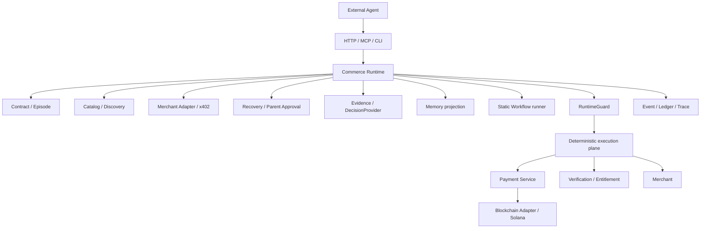

# StablePay Architecture

Audit base: `ac2dc5144ea2b78f4dd832017f4d4f70a2e1622c`.

StablePay is an Agent Commerce Runtime for controlled paid-capability execution. The lower payment plane remains a separate set of deterministic services. The Runtime composes those services and owns the Episode-level orchestration; it does not create a second payment, merchant, memory, or LLM authority.

## Canonical invariant

```text
State -> Action / Observation -> Decision Proposal -> RuntimeGuard
     -> Deterministic Execution Plane -> Event / Ledger / Trace
```

LLM proposes. Runtime validates. The deterministic plane executes. The event log records. Memory supplies advisory, transaction-grounded context only.

## Components



Payment-plane services are `api-gateway`, `did-service`, `payment-service`, `blockchain-adapter`, `verification-service`, and `query-service`, with RocketMQ/MySQL/Solana as infrastructure. `commerce-runtime/cmd/server` is the Runtime composition root.

## Authority table

| Fact or decision | Authority | Non-authority |
|---|---|---|
| Current quote | trusted x402 parse / payment requirement facts | memory, LLM text |
| Payment state | PaymentIntent, Ledger, Payment Service | Episode execution status |
| Entitlement | verification proof | merchant prose, memory |
| Candidate eligibility | catalog CandidateSet | LLM recommendation |
| Delivery validity | versioned Validator and ValidationEvidence | raw artifact body |
| Business state | `CommerceEpisode` aggregate and committed events | worker status |
| Workflow state | `WorkflowRun` CAS aggregate | child status alone |
| LLM action | proposal subject to parser/context/guard checks | proposal itself |
| Memory | advisory transaction-grounded history | payment, budget, entitlement, eligibility |
| Parent approval | durable `ParentApprovalRequest` + `ParentDecisionFact` | chat text or model output |

## State ownership and lifecycle

The Episode aggregate persists the contract snapshot, its hash, state, budget snapshot, merchant/catalog binding, payment/delivery references, validation evidence references, attempt counters, and deadline. The Runtime runner loads that projection and its facts for every `RunEpisode`/`ResumeEpisode` call.

The normal lifecycle is:

```text
ACCEPTED -> DISCOVERING -> INVOKING -> NEGOTIATING -> PAYING
          -> CLAIMING -> INVOKING_DELIVERY -> VALIDATING_DELIVERY
          -> FULFILLED
```

Recoverable delivery or payment observations enter `RECOVERING`. Quote threshold or recovery approval enters `AWAITING_PARENT`; an approved durable decision resumes `NEGOTIATING` or the guarded recovery path. Terminal states are `FULFILLED`, `FAILED`, `BLOCKED`, `ABORTED`, `EXPIRED`, and `DISPUTED`.

`EpisodeExecutionStatus` is an operations-plane projection with `IDLE`, `RUNNING`, `RETRY_WAIT`, `PAUSED`, `COMPLETED`, and `ERROR`. It is intentionally not an authority over the Episode or payment facts.

## Payment lifecycle and money semantics

The Runtime parses a trusted merchant challenge, creates/reserves a PaymentIntent with an economic identity key, obtains opaque credentials from the adapter, submits through Kitex Payment Service, reconciles unknown/pending results, verifies entitlement, and only then invokes delivery. Retry reuses the durable identity; it is not permission to create a new settlement.

Business values use integer minor units (`amount_minor`). USDC/USDT human amounts use two decimals at the business boundary, while SPL raw token units use six decimals and x402 may use token atomic units. These representations are converted only at their explicit adapter boundaries.

## Trust boundaries

The following are distinct and must not be described as one generic “signature”:

```text
Gateway request signature
Payment authorization signature
Signed Solana transaction
Entitlement proof
RuntimeGuard verdict
```

Agent DID is not the backend hot wallet. The production Runtime receives an opaque credential reference; signing and transaction construction remain in the credential/payment adapter boundary. Secrets are loaded from ignored environment/files and are never part of traces or documentation examples.

## Recovery and memory

The initial merchant selection is deterministic. LLM or `RuleRecoveryProvider` is used for recovery proposals only. The proposal is parsed, checked against current evidence and context, checked against memory provenance when cited, and evaluated by `RuntimeGuard` before a transition can be committed.

Memory is a derived episodic projection with source episode/event references, catalog snapshot binding, validity window, confidence, and `MemoryUseTrace`. A historical success is not current eligibility, and a historical price is not a trusted current quote.

## Workflow semantics

```text
WorkflowDefinition -> WorkflowRun -> WorkflowStep -> CommerceEpisode
```

Workflow v1 is a static, sequential DAG with exactly one output sink. It does not perform dynamic graph rewrite, parallel payment execution, compensation, or workflow-level memory. A fulfilled child’s validated artifact metadata is referenced as `workflow-artifact://run/step`; `WorkflowArtifactResolver` verifies run/step ownership, fulfillment, hash, content type, size, and provenance before resolving a bounded body for the next step.

## Crash windows

| Window | Persisted fact | Restart behavior | Idempotency / duplicate risk |
|---|---|---|---|
| Payment submit | PaymentIntent state and economic key | reconcile before new submit | Payment Service idempotency is authority; duplicate settlement is measured, not declared impossible |
| Payment redelivery | intent/ledger and episode references | load intent and reconcile | same economic identity |
| Merchant delivery | DeliveryArtifact and attempt/event facts | replay delivery according to attempt policy | merchant/Runtime idempotency boundary |
| Child Episode creation | Workflow transition + child metadata | CAS/replay returns existing child | request/workflow idempotency |
| Workflow step attachment | step projection and event idempotency key | reload step/run and reattach only validated provenance | run/step CAS and event key |
| Process crash | `CommerceEpisode` + execution projection | supervisor scans persisted runnable rows after startup | no in-memory workflow state is required |

## Observability boundary

The public observability endpoint exports redacted episode, events, execution status, ledger/payment facts, model decision traces, memory-use traces, artifact metadata, and validation evidence. Artifact bodies require explicit opt-in. API keys, DSNs, private keys, signed transactions, raw prompts, and raw model responses are excluded.

## Source map

| Boundary | Primary implementation |
|---|---|
| Contract / Episode | `commerce-runtime/internal/contract`, `internal/episode` |
| Runtime / Guard | `internal/runtime`, `internal/decision`, `internal/application` |
| Payment / reconciliation | `internal/payment`, `internal/reconciliation`, `internal/adapters` |
| Memory / evidence / LLM | `internal/memory`, `internal/evidence`, `internal/llm`, `internal/trace` |
| Workflow / artifact | `internal/workflow`, `internal/workflowruntime`, `internal/workflow/artifact` |
| External surface | `internal/api`, `cmd/stablepay-runtime`, `cmd/server` |
| Eval / report | `internal/eval`, `internal/observability`, `cmd/stablepay-agent-eval` |
