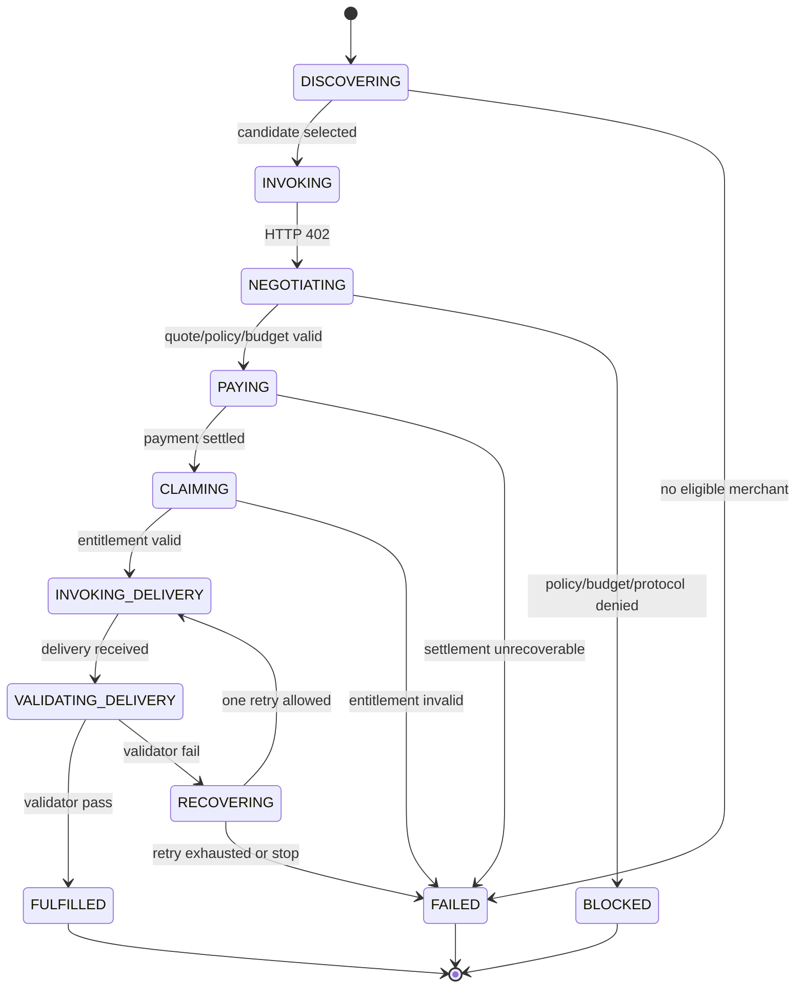

# StablePay Agent Commerce Runtime MVP PRD

> 状态：设计稿（MVP 收敛版）  
> 边界：StablePay 为父 Agent 完成一个**受预算、授权与协议约束的付费能力获取子任务**；它不判断父 Agent 的整体自然语言任务是否完成。

## 1. 问题与目标

StablePay 现有系统擅长确定性的支付执行：身份校验、策略校验、签名、链上结算、凭证验证与审计。这些能力不应被 LLM 接管。

但对于一个 Parent Agent 而言，支付并不是目标，而是获取外部付费能力时可能采取的一次动作。一次支付成功也不代表商户真的交付了可用结果。因此在确定性支付平面之上新增 **Commerce Runtime**：它维护一个有边界的 Commerce Episode，在观察到商户响应和交付质量后，选择下一步受控动作，直至“能力获取契约”被满足或以明确原因终止。

### 1.1 MVP 目标

证明同一 Episode 中的 Observation 会真实改变后续 Action：

```text
AcquireCapabilityRequest
  → Discover Merchant A
  → Invoke A
  → HTTP 402
  → negotiate / policy / pay / claim
  → Invoke A again
  → delivery invalid
  → retry A once
  → validate again
  → FULFILLED or FAILED
```

这里的闭环是：商户的 `402`、交付为空、校验失败等 Observation 改变同一 Episode 的后续执行路径；不是仅将日志留给离线分析。

### 1.2 非目标

- 不判断“把视频转录、校对、翻译、生成 SRT、发布博客”等父任务是否整体完成；
- 不把 LLM 放入 `payment-service`、链上结算或授权决策中；
- 不做跨商户切换、退款/争议自动化、长期 Memory、自动工作流生成、多 Agent、自进化、灰度发布；
- 不用向量检索替代商户结构化目录、策略、账本或协议校验。

## 2. 核心边界与术语

### 2.1 Parent Goal 与 Acquisition Contract

Parent Agent 的泛化目标可能包含多个子任务。StablePay 不拥有其上下文，也不应调用一个通用 Judge 去猜测整体是否完成。

Parent Agent 必须下放一个可验证的能力获取契约：

```yaml
AcquireCapabilityRequest:
  request_id: acr_01...
  parent_episode_id: parent_01...          # 可选，仅用于关联
  requester_did: did:stablepay:...
  acquisition_goal:
    task_type: transcription
    description: 将指定音频转为中文文字稿
  input:
    uri: object://input/audio.mp3
    content_type: audio/mpeg
    sha256: ...
  constraints:
    budget_limit_minor: 10                 # MVP 单币种最小货币单位
    currency: USDC
    deadline_at: 2026-09-01T12:00:00Z
    supported_protocol_versions: [x402-v1]
    max_delivery_attempts: 2
  expected_output:
    type: transcript
    language: zh
    min_duration_coverage: 0.95
  validator:
    kind: builtin
    name: transcript_validator.v1
    config:
      require_non_empty: true
```

MVP 中 `validator` 必须是 Runtime allowlist 中的版本化内置校验器，不能执行父 Agent 任意提供的代码。Runtime 只在该校验器通过时声明：

```text
FULFILLED = merchant delivery satisfies acquisition contract
```

它返回 `delivery + evidence + cost + merchant + trace` 给 Parent Agent；是否已经满足 Parent Goal，始终由 Parent Agent 判断。

### 2.2 支付是不可逆副作用，不是完成条件

支付是 Episode 的受控 Action，而非 Episode Goal；对于链上结算，它还可能是不可逆副作用。支付失败后的恢复是重试、替代商户、退款、补偿或争议（后四者不属于 MVP），不是假设可以 rollback settlement。

每个 Episode 必须单独记录以下金额，且 MVP 限定为单币种：

| 字段 | 含义 |
| --- | --- |
| `budget_limit` | 父 Agent 允许消耗的总上限 |
| `reserved_amount` | 已通过校验、等待或进行中支付而暂占的金额 |
| `settled_amount` | 已成功结算的累计金额 |
| `refunded_amount` | 已确认退款的累计金额；MVP 只保留账务字段 |
| `available_budget` | `budget_limit - settled_amount - reserved_amount` |
| `sunk_cost` | `max(0, settled_amount - refunded_amount)`，已发生且尚未追回的成本 |

一次已结算但交付失败的支付仍计入 `sunk_cost`。后续决策只能在剩余可用预算与授权边界内发生。

## 3. 三个稳定接口

### 3.1 `AcquireCapabilityRequest`

这是 Parent Agent 与 Commerce Runtime 的输入契约，字段见 2.1。除业务输入外，Runtime 必须持久化其规范化快照与 `request_hash`，避免运行期间目标、预算或校验器被静默修改。

### 3.2 `CommerceEpisode`

`CommerceEpisode` 是 Runtime 的权威状态，不是 LLM 的上下文摘要。建议最小模型：

```yaml
CommerceEpisode:
  episode_id: ce_01...
  request_id: acr_01...
  request_snapshot_hash: sha256:...
  state: DISCOVERING
  terminal_reason: null
  selected_merchant_did: null
  selected_capability_id: null
  quote_hash: null
  entitlement_ref: null
  delivery_ref: null
  validation_evidence_ref: null
  attempts:
    initial_invoke: 0
    delivery_invoke: 0
    payment: 0
  budget:
    currency: USDC
    budget_limit: 10
    reserved_amount: 0
    settled_amount: 0
    refunded_amount: 0
    available_budget: 10
    sunk_cost: 0
  version: 1
  created_at: ...
  updated_at: ...
```

状态更新使用乐观锁版本号与幂等键；所有金额变化都由确定性的 Ledger 组件执行，不能由模型文本直接写入。

### 3.3 `EpisodeEvent`

每次状态迁移追加一条不可变事件，为回放、审计和后续分析提供一致事实：

```yaml
EpisodeEvent:
  event_id: evt_01...
  episode_id: ce_01...
  sequence: 12
  occurred_at: ...
  state_before: VALIDATING_DELIVERY
  action: VALIDATE_DELIVERY
  observation:
    type: DELIVERY_INVALID
    facts_ref: object://trace/...
    payload_hash: sha256:...
  decision:
    type: RETRY_SAME_MERCHANT
    proposal_ref: object://trace/...
    reason: transcript is empty; retry budget remains
  state_after: RECOVERING
  actor: runtime | tool | model | parent
  trace_id: ...
  runtime_version: commerce-runtime-mvp.1
```

敏感输入、签名和完整交付内容只存受控引用；事件中保留哈希、摘要、脱敏字段与关联 ID。

## 4. Action、Observation 与 Decision

`Action`、`Observation`、`Decision` 是 Episode 的受控语言，不接受模型直接执行任意工具调用。

| 类型 | MVP 枚举 | 责任 |
| --- | --- | --- |
| Action | `DISCOVER`、`INVOKE`、`PARSE_402`、`RESERVE_BUDGET`、`CREATE_PAYMENT`、`VERIFY_ENTITLEMENT`、`VALIDATE_DELIVERY`、`RETRY_SAME_MERCHANT`、`STOP` | Runtime 或受控 Tool 实际执行 |
| Observation | `CANDIDATES_FOUND`、`HTTP_402`、`QUOTE_VALID`、`POLICY_DENIED`、`PAYMENT_SETTLED`、`ENTITLEMENT_VALID`、`DELIVERY_VALID`、`DELIVERY_INVALID`、`TOOL_ERROR`、`DEADLINE_EXCEEDED` | 外部环境或确定性校验产生 |
| Decision | `SELECT_MERCHANT`、`NEGOTIATE_AND_PAY`、`RETRY_SAME_MERCHANT`、`STOP` | 模型可提议，Runtime 最终批准 |

模型输出是 `DecisionProposal`，至少包含 `decision`、候选依据、所依赖 Observation 的事件序号和置信说明。Runtime 在执行前强制校验：

```text
is_action_allowed(current_state)
&& policy_allows(requester, merchant, amount)
&& budget_sufficient(quote)
&& attempts_remaining(episode)
&& before_deadline(episode)
&& idempotency_valid(action)
```

因此：**LLM 不拥有状态机，也不拥有支付授权；它仅在指定状态迁移内提出受约束的决策。**

## 5. 职责划分

| 确定性 Runtime / 支付平面 | Agentic 决策层 |
| --- | --- |
| 解析 402、校验 quote/协议版本、策略与授权、预算账务、DID 验签、创建和确认支付、凭证验证、重试计数、deadline、幂等与审计 | 理解 acquisition goal、在合格候选间做语义匹配与排序、提出调用计划、解释 Observation、对部分失败分类、在允许集合中提出恢复策略、修正调用输入 |

底层保持现有 StablePay Deterministic Plane：CloudWeGo / Hertz / Kitex、DID、Payment、Blockchain、Entitlement、Audit。Commerce Runtime 是其上层独立服务，通过受控 API / MCP Tools 调用它们；`payment-service` 不加载模型运行时。

```text
Parent Agent
  │ AcquireCapabilityRequest
  ▼
StablePay Commerce Runtime
  ├─ Episode State / Ledger / Event Log
  ├─ Structured Merchant Discovery + semantic context
  └─ constrained DecisionProposal
  │ controlled tools
  ▼
StablePay Deterministic Plane
  Policy → DID → Payment → Settlement → Entitlement → Audit
```

## 6. Merchant Discovery 与检索边界

商户发现不是“将 `merchant/` 下 Markdown 全部 embedding 后交给 LLM 选择”。先做确定性的结构化候选筛选：

```yaml
MerchantCapability:
  merchant_did: did:merchant:A
  capability_id: transcription.standard
  task_types: [transcription]
  input_schema: audio/*
  output_schema: transcript.v1
  currency: USDC
  price_model: per_minute
  protocol_version: x402-v1
  status: ACTIVE
```

```text
task_type matches
∧ status = ACTIVE
∧ protocol supported
∧ currency supported
∧ quoted/worst-case price ≤ available_budget
→ candidate set
```

在候选集形成后，才使用语义检索作为上下文：

- 从 `merchant/` 的能力说明中判断“是否适合扫描版 PDF”“是否支持说话人分离”等结构化字段未覆盖的语义差异；
- 从 `stablepayAI-documentation/` 检索 x402、支付、验签、交付协议和错误码说明，辅助解释如 `SIGNATURE_SCOPE_INVALID`；
- 将结果作为 ranking / plan 的证据，不能产生支付许可，也不能覆盖数据库中的 `ACTIVE`、价格、协议版本或账本事实。

MVP 可先实现确定性排序（价格、协议兼容、状态）并固定选取 Merchant A；语义 rerank 仅保留接口和 trace，不作为验收前提。

## 7. MVP 状态机与单任务 Inner Loop



### 7.1 一个完整 Episode 的时序

| 阶段 | Action | Observation | Decision / Runtime 约束 | 状态与账务 |
| --- | --- | --- | --- | --- |
| 1 | `DISCOVER` | `CANDIDATES_FOUND(A)` | 仅从结构化合格候选中选择 A | `DISCOVERING → INVOKING` |
| 2 | `INVOKE(A)` | `HTTP_402(requirements)` | 402 改变路径：提议 `NEGOTIATE_AND_PAY` | `INVOKING → NEGOTIATING` |
| 3 | 解析 quote、策略校验、`RESERVE_BUDGET` | `QUOTE_VALID` | Runtime 校验预算/协议/DID/策略；reserve 后才创建支付 | `reserved += quote` |
| 4 | `CREATE_PAYMENT` | `PAYMENT_SETTLED` | 以 idempotency key 结算；不能 rollback 已结算金额 | `reserved -= quote; settled += quote; sunk_cost` 更新 |
| 5 | `VERIFY_ENTITLEMENT` | `ENTITLEMENT_VALID` | 仅凭证有效才允许重调商户 | `PAYING → CLAIMING → INVOKING_DELIVERY` |
| 6 | `INVOKE(A)` | delivery returned | 调用次数受请求上限限制 | `INVOKING_DELIVERY → VALIDATING_DELIVERY` |
| 7 | `VALIDATE_DELIVERY` | `DELIVERY_VALID` | 内置 validator 对 expected output 产出证据 | `FULFILLED` |
| 7' | `VALIDATE_DELIVERY` | `DELIVERY_INVALID` | 若尚余一次尝试，模型只能提议 `RETRY_SAME_MERCHANT`，Runtime 校验计数和 deadline | `RECOVERING → INVOKING_DELIVERY` |
| 8 | `VALIDATE_DELIVERY` | again invalid | 无剩余重试，停止；已结算金额仍为 sunk cost | `FAILED: DELIVERY_RETRY_EXHAUSTED` |

`FULFILLED` 不等于 Parent Goal 完成，它只等于本次 `AcquireCapabilityRequest` 的输出通过明确 validator。Parent Agent 可继续执行校对、翻译、发布等后续步骤。

## 8. 交付结果与错误契约

成功结果：

```yaml
FulfillmentResult:
  episode_id: ce_01...
  status: FULFILLED
  delivery_ref: object://delivery/...
  validation:
    validator: transcript_validator.v1
    passed: true
    evidence_ref: object://evidence/...
  merchant:
    did: did:merchant:A
    capability_id: transcription.standard
  cost:
    currency: USDC
    settled_amount: 3
    refunded_amount: 0
    sunk_cost: 3
  trace_ref: object://trace/ce_01...
```

失败或阻断同样返回可处理的结构化结果：

```yaml
CommerceFailure:
  episode_id: ce_01...
  status: FAILED | BLOCKED
  reason: NO_ELIGIBLE_MERCHANT | POLICY_DENIED | BUDGET_EXCEEDED |
          PROTOCOL_UNSUPPORTED | PAYMENT_FAILED | ENTITLEMENT_INVALID |
          DELIVERY_RETRY_EXHAUSTED | DEADLINE_EXCEEDED
  cost_snapshot: { ... }
  trace_ref: object://trace/ce_01...
```

## 9. MVP 验收与测试

验收不以“接入了 RAG / Memory / LLM”作为条件，而验证受控闭环是否真实存在：

1. 模拟 Merchant A：首次调用返回 `402`；付款、凭证验证后返回空 transcript；重试一次返回有效 transcript。Episode 必须依次产生对应 Event，最终 `FULFILLED`。
2. 相同场景中第二次交付仍为空：Episode 必须以 `DELIVERY_RETRY_EXHAUSTED` 失败，且不得再次创建支付；账务中已结算金额正确保留为 `sunk_cost`。
3. quote 超预算、协议不兼容、策略拒绝、重复请求和 deadline 超时都必须在 Runtime 拦截，不得调用支付工具。
4. 覆盖状态迁移、Ledger 原子更新、支付幂等、Entitlement 验证、validator 证据、Event 顺序及脱敏审计测试。
5. Trace 能回答：当时看到了什么 Observation、谁提出了何种 Decision、Runtime 为什么允许/拒绝该 Action、实际成本是多少。

## 10. 延后路线（非 MVP）

在 MVP 证明同商户闭环后，按风险逐项扩展：

1. 跨商户替代：`SWITCH_MERCHANT` 必须使用 `available_budget` 与 `sunk_cost`，不能忽略已结算成本；
2. 退款、补偿、争议：以独立状态和账务事件建模，而非“回滚支付”；
3. Episodic / User Semantic Memory：只有删除它会降低未来商户排序或恢复决策质量时才引入；策略与 Ledger 永远不叫 Memory；
4. Trace 归因、历史回放、候选排序/Workflow 规则、灰度与回滚：这是建立在大量真实 Episode Trace 之上的 Outer Loop，不提前伪造“自进化”；
5. 语义 rerank、RAG、MCP Skill 与 Parent Agent 集成：均保持在确定性授权和执行边界之外。

## 11. 建议的服务边界

新增独立 `commerce-runtime` 服务即可，不改造 `payment-service` 为模型服务：

```text
commerce-runtime/
  episode/        # AcquireCapabilityRequest、状态机、事件与幂等
  catalog/        # MerchantCapability 结构化发现
  decision/       # DecisionProposal 接口及可选模型适配器
  validator/      # allowlisted builtin validators
  ledger/         # budget reservation / settlement projection
  tools/          # merchant invoke、StablePay payment / entitlement adapters
  trace/          # 脱敏事件与回放数据
```

第一期可以完全使用规则化 `DecisionProposal` 选择唯一候选和同商户重试；模型接入后只替换 `decision/` 内的提议生成，不改变支付、账务、策略、状态机和审计的确定性语义。
