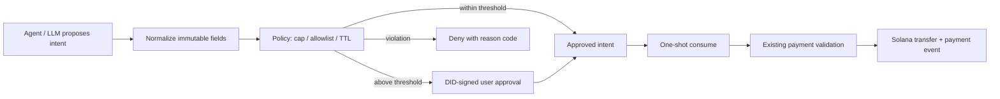

# StablePay Agent Payment Harness

## Why this is an Agent backend capability, not a plugin wrapper

StablePay originally established the **settlement plane**: DID identity, HTTP 402, business signatures, idempotency, balance checks, Solana transfer, and purchase verification. That alone proves that an Agent can pay, but leaves the important question unanswered: **who is allowed to decide that a payment should happen?**

The Agent Payment Harness is a server-side control plane placed in front of `BlockchainAdapter.ExecuteTransfer`. It treats the LLM/OpenClaw runtime as an untrusted proposer of a payment intent. It may explain a purchase or extract a purpose from the conversation, but it never receives a direct path to the chain executor.



The fixed DAG is `Normalize → Policy → Approval → Execute`. The final two stages are deterministic Go code and are independently auditable; probabilistic model output cannot skip them.

## State and security boundary

| State | Meaning | Can transfer? |
| --- | --- | --- |
| `PENDING_USER_CONFIRMATION` | Over the auto-approval cap; waiting for a signature over this exact intent. | No |
| `APPROVED` | Auto-approved by policy or approved by a valid DID signature. | Once |
| `CONSUMED` | Redis `GETDEL` removed the grant immediately before execution. | No |
| `REJECTED` | Policy disallowed amount or merchant. | No |

An approval is a signature over a canonical string containing `intent_id`, buyer DID, merchant DID, amount in minor units, currency, and policy version. A reply such as “yes” is therefore not reusable for another merchant or amount. An intent is short-lived and one-shot; duplicated tool calls cannot both use it because the server atomically reads and deletes it.

The existing payment business signature, balance check, nonce protection, idempotency record, and blockchain validation remain in place. Approval and payment signatures are verified through the DID Service `VerifySignature` Kitex RPC against the registered DID. The Harness adds a decision boundary; it does not replace settlement controls.

## API sequence

1. `POST /api/v1/agent/payment-intents` with immutable payment fields plus `purpose`.
2. Read `decision`:
   - `ALLOW`: the response has an approved `intent_id`.
   - `REQUIRE_USER_CONFIRMATION`: sign `approval_payload` with the buyer DID.
   - `DENY`: surface `reason_codes`; do not attempt payment.
3. For confirmation, send signature, timestamp, and nonce to `POST /api/v1/agent/payment-intents/{intent_id}/approve`.
4. Submit the existing `POST /api/v1/pay` request with `intent_id`.

Example intent:

```json
{
  "agent_did": "did:solana:buyer",
  "skill_did": "did:solana:merchant",
  "amount": "15.00",
  "currency": "USDC",
  "purpose": "unlock the verified industry report",
  "resource_uri": "https://merchant.example/execute"
}
```

## Safe rollout

`agent_harness.enabled` is off by default so deployed clients keep working. First enable it with `require_intent_for_payment: false` to observe plan/decision traffic. After the Agent client sends `intent_id` on every governed payment, turn on `require_intent_for_payment: true`.

The initial policy supports auto-approval caps, hard per-intent caps, TTL, policy versioning, and an optional merchant DID allowlist. Daily budgets, merchant reputation, anomaly scores, and policy experiments belong in subsequent versions; they should be added as new deterministic policy inputs rather than delegated to the model.

## Interview-ready narrative

> 我把 StablePay 从“Agent 能调用的 402 支付插件”升级成了“Agent 支付治理后端”。原来链路能完成 DID 签名、余额校验和 Solana 结算，但模型或插件拿到支付接口后，支付意图与链上执行之间没有服务端边界。我在 Payment Service 前增加了固定 DAG 的 Agent Payment Harness：先把对话产出的付款意图归一化，再做金额上限、商户白名单和 TTL 策略；超过自动阈值时，要求用户 DID 对包含商户、金额、币种与策略版本的 canonical payload 二次签名。批准后的 intent 通过 Redis `GETDEL` 作为一次性执行凭证，最后才进入原有的幂等、验签、余额与链上转账链路。这样 LLM 只能提议和解释，不能越过确定性治理层直接花钱，支付决策和执行轨迹也能完整审计。

Suggested stack: `Agent Harness / Agent DAG / DID signed approval / HTTP 402 / Redis GETDEL / idempotency / Go / Hertz / Kitex / RocketMQ / MySQL / Solana`.
